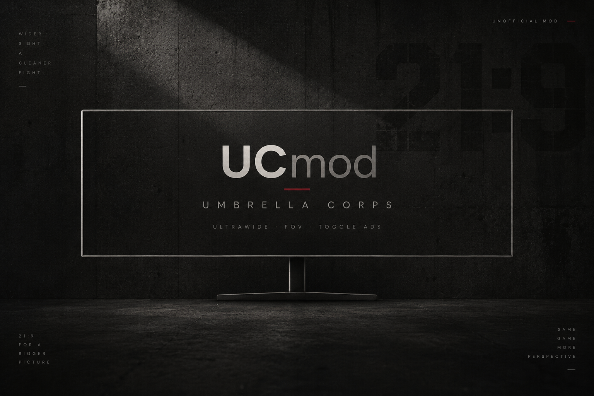
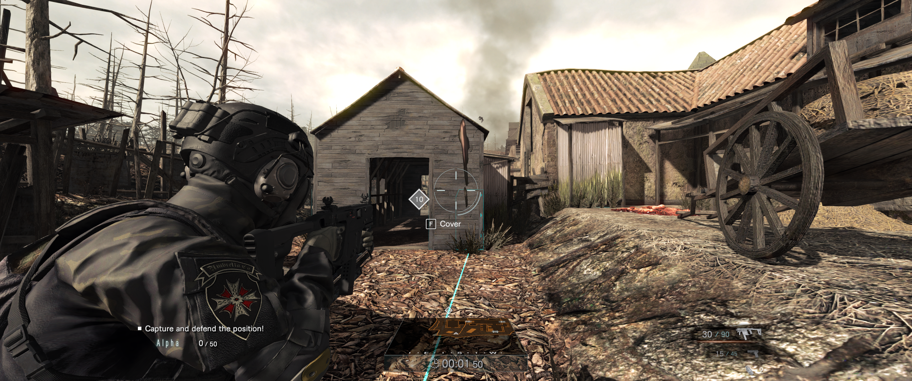

# UCmod

Ultrawide support, adjustable field of view, corrected UI layout, and toggle ADS for **Umbrella Corps** on Windows.



**[Download on itch.io](https://b2kdaman.itch.io/ucmod)** · **[GitHub releases](https://github.com/b2kdaman/UCmod/releases)**

## Features

- Full-width world rendering, tested at **3440×1440**.
- Adjustable horizontal FOV, default **120°**, with native weapon zoom ratios preserved.
- Height-fitted UI and matching menu mouse hit-testing.
- Toggle ADS: tap your configured aim button to aim; tap again to stop.
- Settings reload while the game is running.
- Installer verifies the supported runtime, preserves settings, and backs up the original runtime for restoration.



## Install

Download the mod ZIP from the release page, extract it to a separate folder, close the game, and follow the included `README.txt`. From PowerShell in the extracted folder:

```powershell
powershell.exe -NoProfile -ExecutionPolicy Bypass -File .\Install.ps1 -GamePath "E:\SteamLibrary\steamapps\common\Umbrella Corps"
```

Replace the path with your game folder. The execution-policy argument applies only to that PowerShell process. Launch normally and allow approximately **25 seconds** for activation.

Do not copy the payload directly over the game: the installer must create and verify the original runtime backup first. The GitHub source ZIP is not the installable mod ZIP.

## Configuration

Edit `<game>/UltrawideFix/settings.ini`:

```ini
Enabled=true
Width=3440
Height=1440
HorizontalFOV=120
NativeVerticalFOV=55
GameplayCamera=Camera
UIScale=1
ToggleADS=true
```

`ToggleADS=false` restores hold aiming. `Enabled=false` disables camera/UI adjustments independently. `UIScale=1` is normal; lower values shrink the UI. Leave the native FOV and camera name at their defaults. The FOV is horizontal and unzoomed; ADS remains narrower.

## Uninstall / restore

Close the game, then run from its folder:

```powershell
powershell.exe -NoProfile -ExecutionPolicy Bypass -File .\UltrawideFix\Restore-Original.ps1
```

This verifies and restores the original runtime. Remaining mod files are inert. Game saves are not modified.

## Beta status

Version **0.1.0-beta.1** targets the installed **Unity 5.2.3p1, 32-bit Mono** build. The installer requires the known original runtime hash documented in the release README.

Verified locally: menu clicks, equipment panel and gameplay HUD fit, full-width world rendering, and ADS tap/release/second-tap behavior after a mission retry. The user confirmed the toggle behavior. Some transition/death dimming overlays remain at 16:9. Not all pause/focus/sprint reset paths, weapons, missions, resolutions, or multiplayer scenarios have been tested.

## Build and release

See [BUILDING.md](docs/BUILDING.md). This repository contains custom source, tested mod binaries, the Harmony dependency and license, packaging scripts, and artwork. It does **not** contain the original game runtime, Unity/game assemblies, extracted game code, or saves. Building requires your own game installation.

Custom code is MIT licensed; see [LICENSE](LICENSE). Harmony has its own MIT notice in [THIRD-PARTY-NOTICES.txt](THIRD-PARTY-NOTICES.txt). The gameplay screenshot depicts Capcom's game and is excluded from the code license. The cover was generated with AI; code and documentation were developed with AI assistance. [Artwork provenance](docs/ARTWORK.md).

Unofficial fan-made mod. Not affiliated with or endorsed by Capcom.
